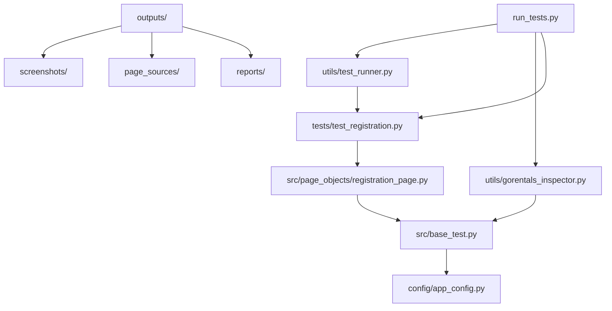

# GoRentals Automation - Complete File Structure

## 📁 Project Overview
```
gorentals_automation/                    # 🏠 PROJECT ROOT
│
├── 📖 DOCUMENTATION FILES
│   ├── PROJECT_GUIDE.md               # 📋 Complete project explanation
│   ├── HOW_TO_RUN.md                  # 🚀 Quick start guide
│   ├── README.md                      # 📖 Full documentation
│   ├── QUICKSTART.md                  # ⚡ 5-minute setup
│   └── FILE_STRUCTURE.md              # 📁 This file
│
├── 🛠️ CONFIGURATION & SETUP
│   ├── config/
│   │   ├── app_config.py              # ⚙️ Main configuration file
│   │   └── __init__.py
│   ├── requirements.txt               # 📦 Python dependencies
│   ├── run_tests.py                   # 🎮 Simple test runner
│   └── .gitignore                     # 🚫 Git ignore rules
│
├── 💻 SOURCE CODE
│   └── src/
│       ├── base_test.py               # 🏗️ Base test class
│       ├── gorentals_automation.py    # 🔧 Legacy automation class
│       ├── page_objects/
│       │   ├── registration_page.py   # 📱 Registration page object
│       │   └── __init__.py
│       └── __init__.py
│
├── 🧪 TEST CASES
│   └── tests/
│       ├── test_registration.py       # ✅ NEW: Structured tests
│       ├── test_gorentals.py          # 🔍 Basic app tests
│       ├── test_gorentals_registration.py # 📝 Legacy tests
│       └── __init__.py
│
├── 🛠️ UTILITIES & TOOLS
│   └── utils/
│       ├── test_runner.py             # 📊 Advanced test runner
│       ├── gorentals_inspector.py     # 🔍 Interactive inspector
│       └── __init__.py
│
├── 📤 OUTPUTS (Auto-generated)
│   └── outputs/
│       ├── screenshots/              # 📸 Test screenshots
│       ├── page_sources/             # 📄 XML page sources
│       └── reports/                  # 📊 Test reports
│
└── 📚 DOCUMENTATION
    └── docs/                         # 📖 Additional docs (expandable)
```

---

## 🎯 Key Files Explained

### 📖 **Documentation Files**
- **`PROJECT_GUIDE.md`** - Complete explanation of structure and usage
- **`HOW_TO_RUN.md`** - Quick reference for running tests  
- **`README.md`** - Full framework documentation
- **`QUICKSTART.md`** - 5-minute setup guide

### ⚙️ **Configuration Files**
- **`config/app_config.py`** - Main configuration (APP PATH, DEVICE, LOCATORS)
- **`requirements.txt`** - Python package dependencies
- **`run_tests.py`** - Simple command-line test runner

### 💻 **Source Code**
- **`src/base_test.py`** - Foundation class (driver setup, screenshots, logging)
- **`src/page_objects/registration_page.py`** - Page Object Model for registration

### 🧪 **Test Files**
- **`tests/test_registration.py`** - Modern unittest-based tests
- **`tests/test_gorentals.py`** - Basic app exploration
- **`tests/test_gorentals_registration.py`** - Legacy registration test

### 🛠️ **Utility Tools**
- **`utils/test_runner.py`** - Advanced runner with HTML/JSON reports
- **`utils/gorentals_inspector.py`** - Interactive app exploration tool

---

## 🚀 How to Use These Files

### 1. **Start Here** 
```bash
# Read this first
cat HOW_TO_RUN.md

# For detailed understanding
cat PROJECT_GUIDE.md
```

### 2. **Configure Your Setup**
```bash
# Edit main configuration
nano config/app_config.py

# Update APK path and device name
```

### 3. **Run Tests**
```bash
# Simple way
python run_tests.py all

# Advanced way  
python utils/test_runner.py
```

### 4. **Explore Your App**
```bash
# Interactive exploration
python run_tests.py inspector
```

### 5. **View Results**
```bash
# Check outputs
ls outputs/screenshots/
ls outputs/reports/
```

---

## 📂 File Dependencies



---

## 💡 Next Steps

1. **Configure**: Update `config/app_config.py` with your app details
2. **Run Setup Check**: `python run_tests.py setup-check`
3. **Start Testing**: `python run_tests.py all`
4. **Explore**: `python run_tests.py inspector`
5. **View Results**: Check `outputs/` folder

**Happy Testing!** 🎉 