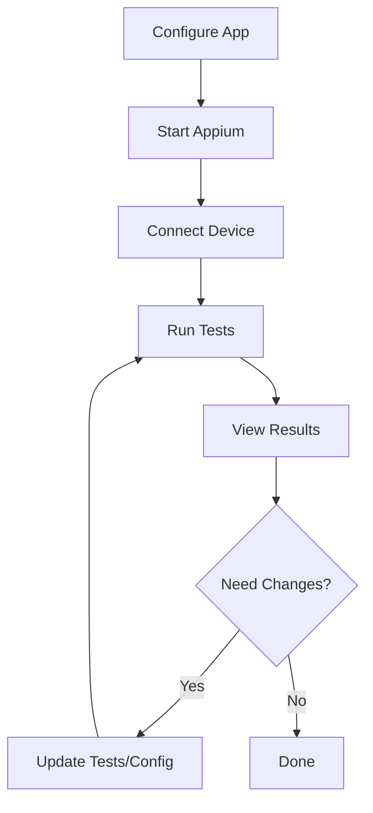

# GoRentals Automation Project Guide

## 📁 Project Structure Explained

### Overview
This is a professional mobile app automation framework built with **Appium + Python** following industry best practices including the **Page Object Model (POM)** design pattern.

```
gorentals_automation/
├── 📂 src/                     # SOURCE CODE - Core framework
├── 📂 tests/                   # TEST CASES - All test scenarios
├── 📂 config/                  # CONFIGURATION - Settings & locators
├── 📂 utils/                   # UTILITIES - Helper tools & runners
├── 📂 outputs/                 # OUTPUTS - Auto-generated results
├── 📂 docs/                    # DOCUMENTATION - Project docs
├── 📄 README.md               # Full documentation
├── 📄 QUICKSTART.md           # 5-minute setup guide
├── 📄 run_tests.py            # Simple test runner
└── 📄 requirements.txt        # Python dependencies
```

---

## 🔍 Detailed Directory Breakdown

### 📂 `src/` - Source Code
**Purpose**: Contains the core automation framework code

```
src/
├── base_test.py               # Base class with common methods
├── page_objects/              # Page Object Model implementations
│   └── registration_page.py   # Registration screen interactions
└── __init__.py               # Python package marker
```

**What's inside:**
- **`base_test.py`**: Foundation class providing common functionality like:
  - Driver setup/teardown
  - Screenshot capture
  - Element interaction methods
  - Logging setup
  - Wait mechanisms

- **`page_objects/registration_page.py`**: Encapsulates the registration screen:
  - Mobile number input methods
  - Checkbox interaction
  - Button state checking
  - Complete registration flow

### 📂 `tests/` - Test Cases
**Purpose**: Contains all test scenarios and test classes

```
tests/
├── test_registration.py       # NEW: Structured registration tests
├── test_gorentals.py          # Basic app exploration test
├── test_gorentals_registration.py # Legacy registration test
└── __init__.py               # Python package marker
```

**What's inside:**
- **`test_registration.py`**: Modern test class using unittest framework:
  - Element validation tests
  - Input field testing
  - Checkbox functionality
  - Complete flow testing
  - Data-driven testing scenarios

### 📂 `config/` - Configuration
**Purpose**: Centralized configuration management

```
config/
├── app_config.py             # Main configuration file
└── __init__.py              # Python package marker
```

**What's inside:**
- **Appium Configuration**: Device settings, app path, capabilities
- **Test Configuration**: Timeouts, retry settings, screenshot options
- **Element Locators**: Centralized UI element selectors
- **Test Data**: Mobile numbers, usernames, test scenarios
- **Path Management**: Output directories, file paths

### 📂 `utils/` - Utilities
**Purpose**: Helper tools and test runners

```
utils/
├── test_runner.py            # Advanced test runner with reporting
├── gorentals_inspector.py    # Interactive app inspector
└── __init__.py              # Python package marker
```

**What's inside:**
- **`test_runner.py`**: Professional test execution with:
  - JSON and HTML report generation
  - Test discovery
  - Execution timing
  - Result summarization

- **`gorentals_inspector.py`**: Interactive tool for:
  - Real-time app exploration
  - Element discovery
  - Screenshot capture
  - Page source analysis

### 📂 `outputs/` - Generated Results
**Purpose**: Auto-generated test artifacts (excluded from git)

```
outputs/
├── screenshots/              # Test execution screenshots
├── page_sources/            # XML UI structure files
└── reports/                # JSON & HTML test reports
```

**Auto-organized by:**
- Test execution timestamp
- Test type (screenshots, sources, reports)
- Clear naming conventions

---

## 🚀 How to Run the Project

### Method 1: Simple Runner (Recommended)
Use the main project runner script:

```bash
# Navigate to project
cd gorentals_automation

# Check if everything is set up
python run_tests.py setup-check

# Run all tests with reporting
python run_tests.py all

# Run specific test types
python run_tests.py registration

# Launch interactive inspector
python run_tests.py inspector
```

### Method 2: Advanced Test Runner
Use the comprehensive test runner:

```bash
# Run all tests with detailed reporting
python utils/test_runner.py

# Run specific test class
python utils/test_runner.py TestRegistration

# Run specific test method
python utils/test_runner.py TestRegistration test_mobile_number_input
```

### Method 3: Individual Test Files
Run tests directly:

```bash
# Run registration tests
python tests/test_registration.py

# Run basic app tests
python tests/test_gorentals.py
```

### Method 4: Standard unittest
Use Python's built-in test runner:

```bash
# Discover and run all tests
python -m unittest discover tests

# Run specific test
python -m unittest tests.test_registration.TestRegistration
```

---

## ⚙️ Configuration Steps

### 1. App Configuration
Edit `config/app_config.py`:

```python
# Update these settings for your environment
APPIUM_CONFIG = {
    "app": "/Users/mohanprasad/Documents/goRentals.apk",  # ← Your APK path
    "device_name": "emulator-5554",                       # ← Your device
    "platform_version": "14",                            # ← Android version
}
```

### 2. Test Data
Customize test data in the same file:

```python
TEST_DATA = {
    "registration": {
        "mobile_number": "+1234567890",    # ← Valid test number
        "invalid_mobile": "123",           # ← Invalid test case
    }
}
```

### 3. Element Locators
Update locators if app UI changes:

```python
LOCATORS = {
    "registration": {
        "mobile_field": 'new UiSelector().className("android.widget.EditText")',
        "submit_button": '//android.view.ViewGroup[@clickable="true"]',
    }
}
```

---

## 📊 Understanding Test Results

### After Running Tests, Check:

#### 1. Console Output
```
GORENTALS TEST EXECUTION SUMMARY
============================================================
Total Tests: 6
Passed: 5
Failed: 1
Errors: 0
Success Rate: 83.3%
Total Duration: 45.67 seconds
============================================================
```

#### 2. Screenshots (`outputs/screenshots/`)
- `test_start.png` - Initial app state
- `mobile_number_entered.png` - After input
- `terms_checkbox_clicked.png` - After checkbox
- `registration_complete.png` - Final state

#### 3. Reports (`outputs/reports/`)
- `test_report_YYYYMMDD_HHMMSS.html` - Visual report (open in browser)
- `test_report_YYYYMMDD_HHMMSS.json` - Machine-readable results
- `test_execution.log` - Detailed execution log

#### 4. Page Sources (`outputs/page_sources/`)
- XML files showing UI structure at test points

---

## 🔧 Troubleshooting Guide

### Common Issues & Solutions

#### 1. **App Not Found**
```bash
Error: App '/path/to/goRentals.apk' not found
```
**Solution**: Update the app path in `config/app_config.py`

#### 2. **Device Not Connected**
```bash
Error: Device 'emulator-5554' not found
```
**Solution**: 
```bash
adb devices                    # Check connected devices
# Update device_name in config/app_config.py
```

#### 3. **Appium Server Not Running**
```bash
Error: Connection refused to localhost:4723
```
**Solution**:
```bash
appium                         # Start Appium server
# Wait for "Appium REST http interface listener started"
```

#### 4. **Element Not Found**
```bash
Error: Element not found: mobile_field
```
**Solution**: Use the inspector to update locators:
```bash
python run_tests.py inspector
# Type: inspect
# Find correct element locators
# Update config/app_config.py
```

---

## 🎯 Development Workflow

### Adding New Tests

#### 1. Create Page Object (if needed)
```python
# src/page_objects/new_page.py
from src.base_test import BaseTest

class NewPage(BaseTest):
    def __init__(self):
        super().__init__()
```

#### 2. Add Test Class
```python
# tests/test_new_feature.py
import unittest
from src.page_objects.new_page import NewPage

class TestNewFeature(unittest.TestCase):
    def setUp(self):
        self.page = NewPage()
        self.page.setup_driver()
```

#### 3. Update Configuration
Add locators and test data to `config/app_config.py`

#### 4. Run and Verify
```bash
python run_tests.py all
```

---

## 📈 Best Practices Implemented

### 1. **Page Object Model (POM)**
- ✅ Separates test logic from page interactions
- ✅ Reusable page methods
- ✅ Centralized element locators
- ✅ Easy maintenance

### 2. **Configuration Management**
- ✅ Single source of truth for settings
- ✅ Environment-specific configurations
- ✅ Easy parameter updates

### 3. **Test Organization**
- ✅ Logical test grouping
- ✅ Setup/teardown methods
- ✅ Independent test execution
- ✅ Data-driven testing

### 4. **Reporting & Documentation**
- ✅ Visual HTML reports
- ✅ Machine-readable JSON
- ✅ Screenshot evidence
- ✅ Execution logs

### 5. **Development Tools**
- ✅ Interactive app inspector
- ✅ Element discovery tools
- ✅ Real-time debugging
- ✅ Multiple run options

---

## 🔄 Project Workflow Summary



**That's it!** You now have a complete understanding of the goRentals automation project structure and how to run it effectively. 🎉 